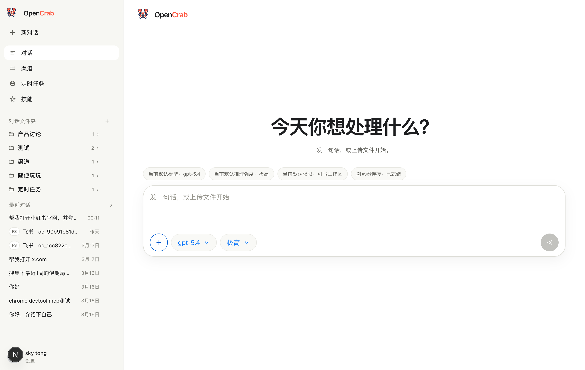
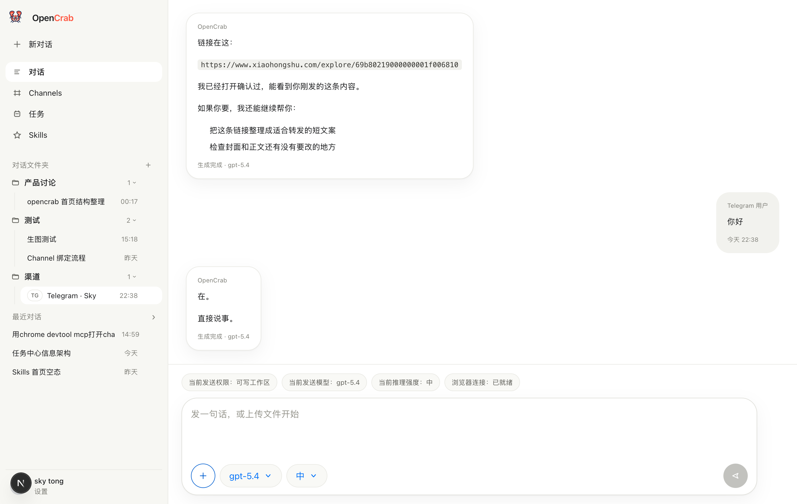
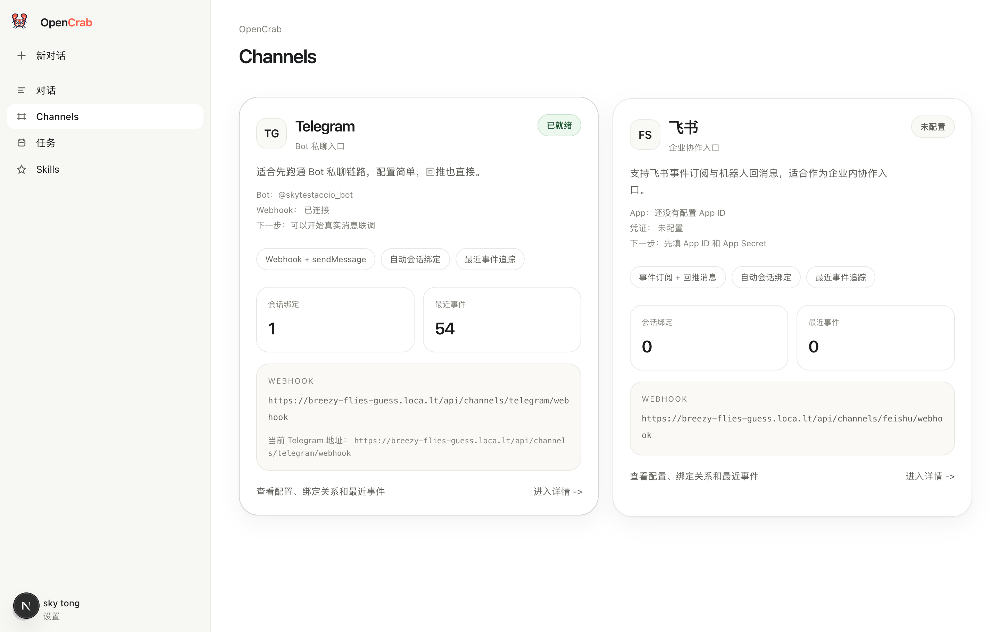
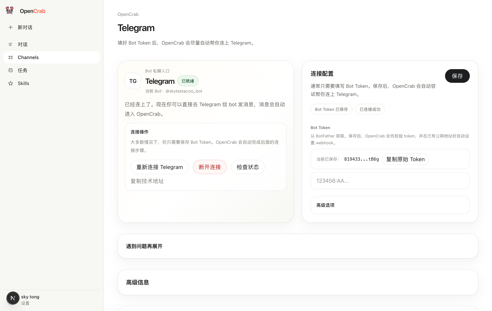
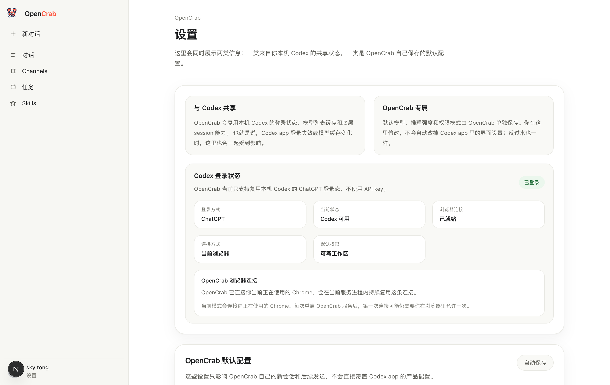

# OpenCrab

<p align="center">
  <a href="https://github.com/KetteyMan/opencrab"></a>
  <a href="./LICENSE"></a>
  
  
  
</p>

<p align="center">
  <a href="./README.md">中文</a> ｜ English
</p>

OpenCrab is a local-first Codex workspace for everyday users.

It keeps the product surface simple: chat is the main entry, Codex is the execution engine, and channels let Telegram or Feishu users talk to the same workspace without learning a developer toolchain first.

## Screenshots

| Home | Conversations |
| --- | --- |
|  |  |

| Channels | Telegram channel |
| --- | --- |
|  |  |

| Settings |
| --- |
|  |

## Highlights

- Chat-first product flow with streaming Codex replies and persistent conversation history
- Folder-based conversation organization with a familiar ChatGPT-style layout
- File and image uploads, plus text extraction for common document formats
- Browser tool integration for current-browser and managed-browser workflows
- Channel support for Telegram and Feishu, including webhook intake, conversation binding, and reply delivery
- Local runtime data and secrets stored outside the repository by default

## Getting Started

### Requirements

- macOS
- Node.js `20.9+`
- `codex` installed and authenticated with `codex login`

### Quick Start

```bash
npm install
cp .env.example .env.local
codex login
npm run dev
```

Open the app at [http://127.0.0.1:3000](http://127.0.0.1:3000).

### Recommended Checks

```bash
npm run lint
npm run typecheck
npm run build
```

## Configuration

Most users can start from the UI, then add secrets only when they need channels.

```bash
OPENCRAB_CODEX_MODEL=gpt-5.4
OPENCRAB_CODEX_REASONING_EFFORT=medium
OPENCRAB_CODEX_SANDBOX_MODE=read-only
OPENCRAB_CODEX_NETWORK_ACCESS=false
OPENCRAB_PUBLIC_BASE_URL=http://127.0.0.1:3000

OPENCRAB_TELEGRAM_BOT_TOKEN=
OPENCRAB_TELEGRAM_WEBHOOK_SECRET=
OPENCRAB_FEISHU_APP_ID=
OPENCRAB_FEISHU_APP_SECRET=
OPENCRAB_FEISHU_VERIFICATION_TOKEN=
```

Channel configuration also works directly from:

- `/channels/telegram`
- `/channels/feishu`

## Runtime Data

OpenCrab stores runtime data in `OPENCRAB_HOME`.

If `OPENCRAB_HOME` is not set, macOS defaults to:

```bash
$HOME/Library/Application Support/OpenCrab
```

Current runtime files:

```text
$OPENCRAB_HOME/
  local-store.json
  channels.json
  channel-secrets.json
  uploads/
  uploads/index.json
  chrome-debug-profile/
```

This keeps conversations, attachments, browser state, and channel secrets out of the repository by default.

## Documentation

- [Product Scope](./docs/product-scope.md)
- [Architecture](./docs/architecture.md)
- [Development Guide](./docs/development.md)
- [Codex Integration](./docs/codex-sdk-integration.md)

## Current Status

The conversation workflow is the most complete part of the product today.

`Channels` already supports Telegram and Feishu in a usable V1 flow. `任务` and `Skills` still exist as product skeletons and are not yet complete feature areas.

## License

[MIT](./LICENSE)
